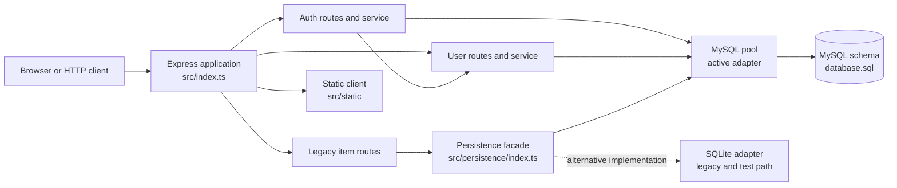
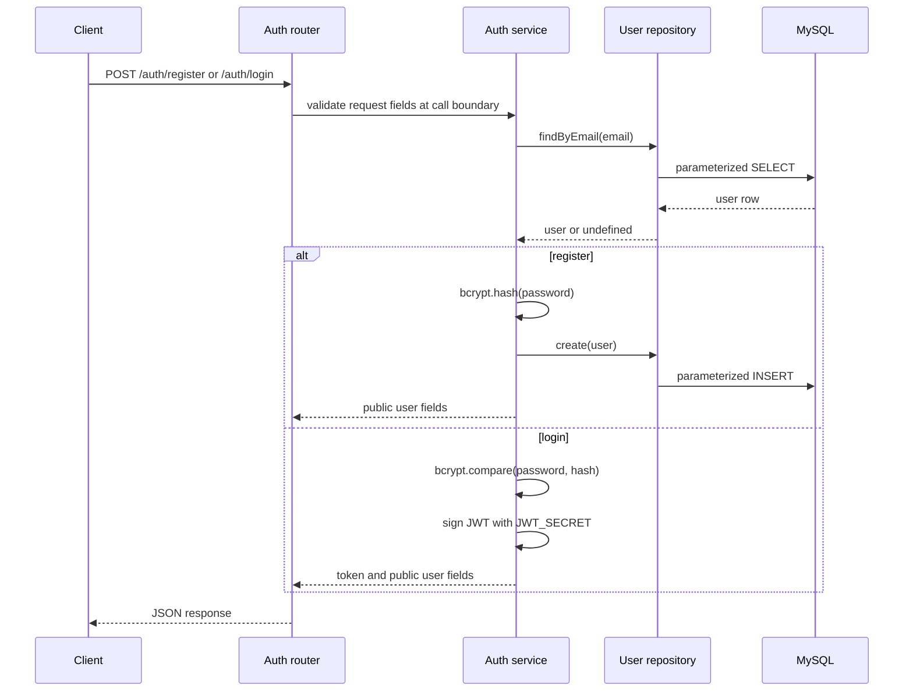

# Architecture

## Scope

This document describes the current architecture of the Legacy todo application. It distinguishes code that is wired into the running server from code that is present as an in-progress module or compatibility path.

## System Overview

The application is a TypeScript Node.js service built on Express. It serves a static browser client when the static assets are available beside the compiled entry point, exposes JSON HTTP endpoints, and persists data through a selected database adapter.

## Runtime Composition

The process is created in `src/index.ts`:

1. Loads environment variables through `dotenv`.
2. Creates an Express application and enables JSON request parsing.
3. Serves files from the `static` directory relative to the compiled entry point. The TypeScript build does not copy the complete `src/static` tree, so deployment must make those assets available under `dist/static`.
4. Registers request logging middleware.
5. Mounts the active routers and legacy item handlers.
6. Initializes the configured persistence adapter.
7. Starts listening on port `3000` only after the database health check succeeds.
8. Closes the database pool or connection on `SIGINT`, `SIGTERM`, and `SIGUSR2`.

The server does not start when database initialization fails. This makes database availability a startup requirement rather than a per-request concern.

## Layers and Responsibilities

### HTTP layer

- `src/index.ts` owns application composition and route registration.
- `src/modules/*/*.route.ts` defines feature routers.
- `src/routes/*.ts` contains the older item handlers mounted directly by the application.
- Routes translate request data into service calls and map successful or failed operations to HTTP responses.

### Service layer

Services contain feature-level operations and basic business rules:

- `auth.service.ts` handles registration, password hashing, credential checks, and JWT creation.
- `user.service.ts` handles user lookup and lifecycle operations.
- `project.service.ts` and `task.service.ts` contain the intended project/task use cases but are not currently exposed by mounted routers.

Services generate entity IDs with `randomUUID()` and generally re-read an entity after an update before returning it.

### Repository layer

Repositories issue parameterized SQL queries through the MySQL pool. The user repository is used by the active authentication and user flows. Project and task repositories represent the intended persistence boundary for those features, but they currently contain copied user queries and return `TodoUser` types; they should be corrected before those modules are enabled.

### Persistence layer

`src/persistence/index.ts` selects MySQL as the application adapter. The MySQL implementation creates a connection pool, validates it with `SELECT 1`, exposes the pool to repositories, and closes it during shutdown.

`src/persistence/sqlite.ts` is a separate legacy adapter used by the SQLite persistence tests. It creates a local `data/todo.db` file and implements the older item CRUD contract. It is not selected by the running application.

## Request Flows

### Authentication

Authentication currently returns a bearer token, but no authentication middleware is registered in `src/index.ts`; the user endpoints are therefore not protected by JWT verification at runtime.

### User management

Requests to `/users` are handled by the user router, which delegates to `user.service.ts`. The service checks for missing records and delegates reads and writes to `user.repository.ts`. Database errors are currently translated into broad `404` or `500` responses by the route handlers.

### Legacy items

The application mounts these compatibility endpoints:

| Method | Path         | Handler         | Persistence operation            |
| ------ | ------------ | --------------- | -------------------------------- |
| GET    | `/items`     | `getItems.ts`   | `getItems()`                     |
| POST   | `/items`     | `addItem.ts`    | `storeItem()`                    |
| PUT    | `/items/:id` | `updateItem.ts` | `updateItem()`, then `getItem()` |
| DELETE | `/items/:id` | `deleteItem.ts` | `removeItem()`                   |

This path expects the older item contract (`name` and `completed`). The current TypeScript `TodoItem` type and MySQL schema instead model project membership, status, description, and deadline. The two contracts are not yet unified.

## Data Model

The MySQL schema in `database.sql` defines three related entities:

- `todo_users`: user identity, email, and bcrypt password hash.
- `todo_projects`: project metadata and its owning user.
- `todo_items`: task metadata, project foreign key, status, and optional deadline.

Foreign keys cascade deletes from users to projects and from projects to items. UUID strings are used as primary keys. The TypeScript types in `src/types.ts` mirror the intended MySQL entities, although the legacy SQLite schema uses a smaller `todo_items` shape.

## Configuration

The MySQL adapter reads these environment variables:

| Variable         | Default     | Purpose                                                               |
| ---------------- | ----------- | --------------------------------------------------------------------- |
| `MYSQL_HOST`     | `localhost` | MySQL server host                                                     |
| `MYSQL_USER`     | `root`      | MySQL user                                                            |
| `MYSQL_PASSWORD` | empty       | MySQL password                                                        |
| `MYSQL_DB`       | `todos`     | Database name                                                         |
| `JWT_SECRET`     | none        | Secret used to sign login tokens; must be supplied for authentication |

The SQLite adapter also supports `DB_LOCATION`, while the persistence test uses `SQLITE_DB_LOCATION` for its test file location. The server port is currently hard-coded to `3000`.

## Testing and Quality Gates

- `npm run build` compiles TypeScript into `dist` using `tsconfig.json`.
- `npm run dev` runs the TypeScript entry point with `tsx watch`.
- The `spec/` directory contains legacy Jest-style tests for SQLite persistence and item handlers.
- `docs/PRECOMMIT.md` documents Prettier, ESLint, and Commitlint hooks.

The existing tests primarily exercise the SQLite/legacy item contract. They do not provide coverage for the active MySQL startup path, authentication flow, or user repository.

## Current Architectural Gaps

These are important implementation facts for maintainers:

1. Only `/auth` and `/users` are mounted from the newer feature-module structure. Project and task routers are empty and are not registered.
2. `project.service.ts` and `task.service.ts` import from a `repositories` directory that is not present under `src/modules`; their repository files also duplicate user repository behavior.
3. `DatabasePersistence` declares only lifecycle and pool access, while the legacy item routes call CRUD methods that are not declared on the interface. The SQLite adapter implements those extra methods, but the selected MySQL adapter does not.
4. JWT verification middleware is absent, so issuing a token does not currently enforce authorization.
5. Request validation, centralized error handling, and structured logging are not yet present. Authentication code currently logs credentials and password validation details, which should be removed before production use.
6. The repository currently contains both the newer relational project/task model and the older standalone item model. A migration strategy is needed before the APIs can share one task contract.

## Extension Guidance

When adding a feature:

1. Define or update its entity type in `src/types.ts` and its schema migration.
2. Add a repository that depends on the persistence abstraction and uses parameterized queries.
3. Put business rules and entity lifecycle operations in a service.
4. Add a router that converts HTTP requests into service calls.
5. Mount the router in `src/index.ts` only after its persistence and error behavior are covered.
6. Add focused tests at the service or repository boundary, plus an HTTP route test for the public contract.

Keep the legacy `/items` path isolated until its contract is either migrated to the project/task model or formally retired.
